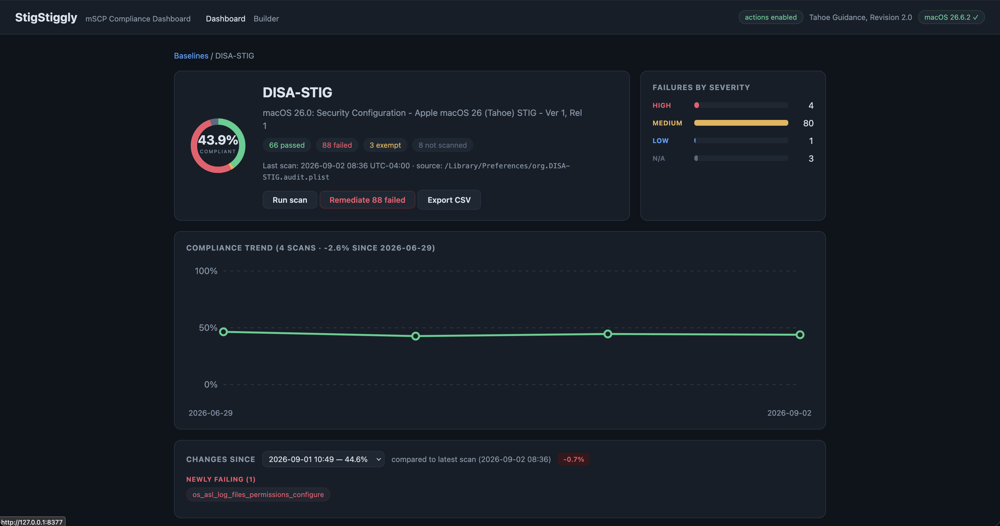

# StigStiggly

A local web UI for the [macOS Security Compliance Project (mSCP)](https://github.com/usnistgov/macos_security):
visualize STIG/CIS compliance, scan and remediate with mSCP's own tooling, tailor
custom baselines, and export reports — all from your browser, all on-device.



## What it does

- **Dashboard** — auto-discovers every mSCP scan result on the machine
  (`org.*.audit.plist`) and joins it with NIST's rule metadata: compliance
  donut, failures by severity, filterable rule tables, and per-rule detail
  (discussion, check/fix commands, STIG IDs, SRG/CCI/800-53 references).
- **Scan & remediate** — runs the mSCP-generated compliance script (`--check` /
  `--fix`) with live streamed output. Remediation always shows a confirmation
  listing exactly which rules will change, then chains a fresh scan.
- **Per-rule remediation** — fix a single failed rule using its own mSCP fix
  commands, verified by re-running the rule's own check; audit results update
  only when verification passes.
- **Exemptions** — mark rules exempt with a documented reason (mSCP's native
  mechanism); exempt rules count toward compliance and are skipped by fixes.
- **Drift tracking** — every scan is snapshotted: compliance trend line plus a
  scan-to-scan comparison showing newly failing/passing/exempt rules, with OS
  version changes flagged (macOS updates quietly revert hardened settings —
  now you can see it).
- **Baseline builder** — start from any stock baseline (DISA-STIG, CIS L1/L2,
  800-53, CMMC, ...), add/remove rules, edit organization-defined values, and
  generate a distributable bundle (compliance script, configuration profiles,
  docs) via mSCP's own `generate_guidance.py`.
- **Device reports** — versioned JSON (`stigstiggly report` or
  `GET /report.json`) with host identity and per-baseline state, ready for
  fleet collection.

## Quick start

Requires macOS and Python 3.12+.

```sh
pipx install git+https://github.com/NarcoMoose/StigStiggly
stigstiggly setup      # downloads the mSCP guidance branch matching your macOS
stigstiggly serve      # read-only dashboard at http://127.0.0.1:8377
sudo stigstiggly serve # enables scans, remediation, and exemptions
```

No guidance content? `serve` opens a guided setup page instead. Other useful
commands:

```sh
stigstiggly doctor            # what's present, what's missing, and why
stigstiggly report            # device compliance report as JSON
stigstiggly serve --repo ...  # use an existing macos_security clone
```

To scan a machine for the first time: open the **Builder**, generate a baseline
(or download a bundle built elsewhere), run its compliance script with
`--check`, and the dashboard picks up the results.

## How it works

StigStiggly deliberately generates **no compliance logic of its own**:

- Scan results are read from the audit plists the mSCP compliance script writes.
- Scans/remediation shell out to the mSCP-generated script; per-rule fixes
  execute the rule's own YAML fix commands verbatim and verify with the rule's
  own check.
- The builder writes mSCP-convention files (`custom/baselines/`,
  `custom/rules/` ODV overrides) and calls the repo's `generate_guidance.py`.
- Exemptions use mSCP's documented `defaults write ... exempt` mechanism.

If mSCP can't do it, StigStiggly doesn't pretend to — it just makes what mSCP
can do visible and operable.

### Security posture

The server binds to 127.0.0.1 only, allowlists Host headers (DNS-rebinding
defense), requires a per-run CSRF token on every state-changing request, only
enables actions when running as root, and refuses `--debug` as root.

## Roadmap

- Admin aggregator view consuming device reports from multiple machines
- Restore / "de-STIG" support once upstream mSCP ships `default_state` content
- Scheduled scans

## Acknowledgements & disclaimer

Built on the [macOS Security Compliance Project](https://github.com/usnistgov/macos_security)
(NIST / NASA / DISA / LANL). StigStiggly is an independent community tool and is
not affiliated with or endorsed by NIST or DISA. Remediation changes real system
settings — review the rule list before confirming, test baselines before
production use, and mind rules that can lock you out (looking at you,
`auth_pam_sudo_smartcard_enforce`).
